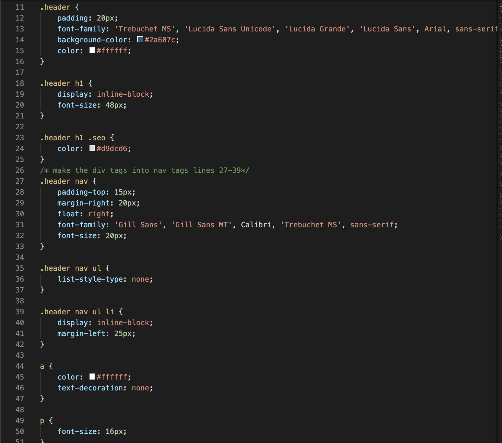

# Code-RefactorHW1

## What I did
In this homework assignment I took all the div tags and I made them into semantic tags including headers, sections, articles, asides, and a footer. Before I was able to do this I had to pull instructions from our class repository and make a new repo myself in git hub. After adding and commiting everything from the start I was able to begin my editing of the original html file. Once I edited that information I took the CSS file and edited all the tags to match those that I changed in the HTML. 

## My Work 
Here are my URLs 
 https://github.com/kaursim000/Code-Refactor
  https://kaursim000.github.io/Code-Refactor/

